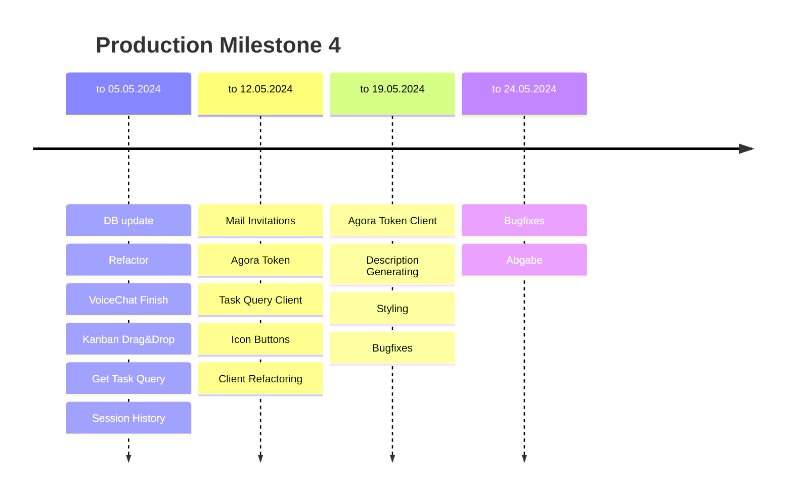

# Contributions

## Dynamically Planned Timeline

## 23.03.2024 - 29.03.2024

### 5v3nn

- https://github.com/sopra-fs24-group07/sopra-fs24-group-07-server/issues/29:
  DB setup
- https://github.com/sopra-fs24-group07/sopra-fs24-group-07-server/issues/82:
  Auth/login endpoint, service
- https://github.com/sopra-fs24-group07/sopra-fs24-group-07-server/issues/19:
  Account creation service
- https://github.com/sopra-fs24-group07/sopra-fs24-group-07-server/issues/16:
  Login service
- https://github.com/sopra-fs24-group07/sopra-fs24-group-07-server/issues/15:
  Login endpoint (also done in
  https://github.com/sopra-fs24-group07/sopra-fs24-group-07-server/issues/82)
- https://github.com/sopra-fs24-group07/sopra-fs24-group-07-server/issues/17:
  Login tests and docu
- https://github.com/sopra-fs24-group07/sopra-fs24-group-07-server/issues/25:
  Create team service
- https://github.com/sopra-fs24-group07/sopra-fs24-group-07-server/issues/26:
  Create team tests and docu
- https://github.com/sopra-fs24-group07/sopra-fs24-group-07-server/issues/24:
  Create team api endpoint

### B1s9l

- https://github.com/sopra-fs24-group07/sopra-fs24-group-07-client/issues/29:
  Landing page & Header setup
- https://github.com/sopra-fs24-group07/sopra-fs24-group-07-client/issues/4:
  Teams Overview page

### Monti934

- https://github.com/sopra-fs24-group07/sopra-fs24-group-07-server/issues/15:
  Login endpoint
- https://github.com/sopra-fs24-group07/sopra-fs24-group-07-server/issues/50:
  Read Agora Documentation

### Alihan26

- https://github.com/sopra-fs24-group07/sopra-fs24-group-07-server/issues/20:
  Account Creation API endpoint
- https://github.com/sopra-fs24-group07/sopra-fs24-group-07-server/issues/21:
  Account Creation tests and docu

## 30.03.2024 - 05.04.2024

### 5v3nn

- https://github.com/sopra-fs24-group07/sopra-fs24-group-07-server/issues/86:
  Link user to team
- https://github.com/sopra-fs24-group07/sopra-fs24-group-07-server/issues/91:
  Add creator to team on team create
- https://github.com/sopra-fs24-group07/sopra-fs24-group-07-server/issues/93:
  Get teams of user
- https://github.com/sopra-fs24-group07/sopra-fs24-group-07-server/issues/95:
  Get users of team
- https://github.com/sopra-fs24-group07/sopra-fs24-group-07-server/issues/53:
  User profile edit api endpoints

### B1s9l

- https://github.com/sopra-fs24-group07/sopra-fs24-group-07-client/issues/2:
  Account creation form done
- https://github.com/sopra-fs24-group07/sopra-fs24-group-07-client/issues/3:
  Login form done

### Monti934

- https://github.com/sopra-fs24-group07/sopra-fs24-group-07-client/issues/2:
  Account creation form done
- https://github.com/sopra-fs24-group07/sopra-fs24-group-07-client/issues/6:
  Dashboard UI done
- https://github.com/sopra-fs24-group07/sopra-fs24-group-07-client/issues/9:
  Create task UI form
- https://github.com/sopra-fs24-group07/sopra-fs24-group-07-client/issues/21:
  Start Session Container

### Alihan26

- https://github.com/sopra-fs24-group07/sopra-fs24-group-07-server/issues/53:
  User profile edit api endpoints
- https://github.com/sopra-fs24-group07/sopra-fs24-group-07-server/issues/54:
  User profile edit services
- https://github.com/sopra-fs24-group07/sopra-fs24-group-07-server/issues/55:
  User profile tests and docu

## 06.04.2024 - 12.04.2024

### 5v3nn

- https://github.com/sopra-fs24-group07/sopra-fs24-group-07-server/issues/57:
  Team invitation
- https://github.com/sopra-fs24-group07/sopra-fs24-group-07-server/issues/33:
  Fixing team creation
- https://github.com/sopra-fs24-group07/sopra-fs24-group-07-server/issues/80:
  Setup DB on GCP

### B1s9l

- https://github.com/sopra-fs24-group07/sopra-fs24-group-07-client/issues/5:
  Create Team UI form done
- https://github.com/sopra-fs24-group07/sopra-fs24-group-07-client/issues/26:
  Profile View Done
- https://github.com/sopra-fs24-group07/sopra-fs24-group-07-client/issues/27:
  Profile Render Done

### Monti934

- https://github.com/sopra-fs24-group07/sopra-fs24-group-07-client/issues/7:
  Edit Task
- https://github.com/sopra-fs24-group07/sopra-fs24-group-07-client/issues/8:
  Display Task Details

### Alihan26

- https://github.com/sopra-fs24-group07/sopra-fs24-group-07-server/issues/32:
  Create task/ get tasks API endpoint
- https://github.com/sopra-fs24-group07/sopra-fs24-group-07-server/issues/33:
  Create task and get tasks service
- https://github.com/sopra-fs24-group07/sopra-fs24-group-07-server/issues/35:
  Create task and get tasks tests and docu

## 13.04.2024 - 19.04.2024

### 5v3nn

- https://github.com/sopra-fs24-group07/sopra-fs24-group-07-server/issues/68:
  Session start endpoint
- https://github.com/sopra-fs24-group07/sopra-fs24-group-07-server/issues/71:
  Session start service
- https://github.com/sopra-fs24-group07/sopra-fs24-group-07-server/issues/72:
  Session end endpoint
- https://github.com/sopra-fs24-group07/sopra-fs24-group-07-server/issues/73:
  Session end service
- https://github.com/sopra-fs24-group07/sopra-fs24-group-07-server/issues/78:
  User endpoint get user data
- https://github.com/sopra-fs24-group07/sopra-fs24-group-07-server/issues/79:
  User service get user data
- https://github.com/sopra-fs24-group07/sopra-fs24-group-07-server/issues/96:
  Leave team endpoint/service
- https://github.com/sopra-fs24-group07/sopra-fs24-group-07-server/issues/118:
  pusher service setup (env vars/testing)

### B1s9l

- https://github.com/sopra-fs24-group07/sopra-fs24-group-07-server/issues/69
  Share session state and content (pusher api)
- https://github.com/sopra-fs24-group07/sopra-fs24-group-07-client/issues/13
  Team settings (only refinements)
- https://github.com/sopra-fs24-group07/sopra-fs24-group-07-client/issues/17
  User profile edit UI & delete user UI
- https://github.com/sopra-fs24-group07/sopra-fs24-group-07-client/issues/21
  Session container (pusher sync)
- https://github.com/sopra-fs24-group07/sopra-fs24-group-07-client/issues/22
  Session button
- https://github.com/sopra-fs24-group07/sopra-fs24-group-07-client/issues/23
  Time goal input (for session) (pusher sync)
- https://github.com/sopra-fs24-group07/sopra-fs24-group-07-client/issues/24
  Session design change, render different views depending on session state

### Monti934

- https://github.com/sopra-fs24-group07/sopra-fs24-group-07-client/issues/23
  Time goal input
- https://github.com/sopra-fs24-group07/sopra-fs24-group-07-client/issues/18
  Team management overview and invite users
- https://github.com/sopra-fs24-group07/sopra-fs24-group-07-client/issues/12
  Team Members UI
- https://github.com/sopra-fs24-group07/sopra-fs24-group-07-client/issues/35
  Kanban Board

### Alihan26

- https://github.com/sopra-fs24-group07/sopra-fs24-group-07-server/issues/110
  PUT Task API Endpoint and Services
- https://github.com/sopra-fs24-group07/sopra-fs24-group-07-server/issues/111
  PUT Task tests and docu
- https://github.com/sopra-fs24-group07/sopra-fs24-group-07-server/issues/40
  Comments API endpoint
- https://github.com/sopra-fs24-group07/sopra-fs24-group-07-server/issues/42
  Comments tests and docu

## 20.04.2024 - 26.04.2024

### 5v3nn

- https://github.com/sopra-fs24-group07/sopra-fs24-group-07-server/issues/130
  delete task status
- https://github.com/sopra-fs24-group07/sopra-fs24-group-07-server/issues/153
  Comments delete service and endpoint
- https://github.com/sopra-fs24-group07/sopra-fs24-group-07-server/issues/46
  team edit service and endpoint
- https://github.com/sopra-fs24-group07/sopra-fs24-group-07-server/issues/49
  team edit tests and docu
- https://github.com/sopra-fs24-group07/sopra-fs24-group-07-server/issues/150
  div bugfixes

### Monti934

- https://github.com/sopra-fs24-group07/sopra-fs24-group-07-client/issues/10
  Create comments on tasks
- https://github.com/sopra-fs24-group07/sopra-fs24-group-07-client/issues/72
  delete comments
- https://github.com/sopra-fs24-group07/sopra-fs24-group-07-client/issues/14
  Voice Chat
- https://github.com/sopra-fs24-group07/sopra-fs24-group-07-client/issues/20
  Breakout rooms

### Alihan26

- https://github.com/sopra-fs24-group07/sopra-fs24-group-07-server/issues/133
  Comments should be in descending order
- https://github.com/sopra-fs24-group07/sopra-fs24-group-07-server/issues/135
  Comments pusher
- https://github.com/sopra-fs24-group07/sopra-fs24-group-07-server/issues/157
  Integration tests for Comment descending order

### B1s9l

- https://github.com/sopra-fs24-group07/sopra-fs24-group-07-client/issues/15:
  Dashboard container for the voice chat
- https://github.com/sopra-fs24-group07/sopra-fs24-group-07-server/issues/150
  lots of div bugfixes: including for client issues #4, #23, #13 (with server #46)
- https://github.com/sopra-fs24-group07/sopra-fs24-group-07-server/issues/135:
  Integrated the pusher api to send signal to fetch new comments
- https://github.com/sopra-fs24-group07/sopra-fs24-group-07-server/issues/117:
  Implemented the pusher subscription for comments

## Dynamically Planned Timeline

## 27.04.2024 - 04.05.2024

### 5v3nn

- https://github.com/sopra-fs24-group07/sopra-fs24-group-07-server/issues/148: DB lengths redo and testing
- https://github.com/sopra-fs24-group07/sopra-fs24-group-07-server/issues/143: Send Mail setup
- https://github.com/sopra-fs24-group07/sopra-fs24-group-07-server/issues/174: Remove session id from get dto

### Monti934

- https://github.com/sopra-fs24-group07/sopra-fs24-group-07-client/issues/75:
  Indicate who is Talking in the VoiceChat
- https://github.com/sopra-fs24-group07/sopra-fs24-group-07-client/issues/42:
  Drag and Drop for KanbanBoard

### Alihan26

- https://github.com/sopra-fs24-group07/sopra-fs24-group-07-server/issues/183
  Get Tasks with Query API Endpoints
- https://github.com/sopra-fs24-group07/sopra-fs24-group-07-server/issues/108
  Get Tasks with Query Services

### B1s9l

- https://github.com/sopra-fs24-group07/sopra-fs24-group-07-client/issues/76:
  Created the files for the session history popup
- https://github.com/sopra-fs24-group07/sopra-fs24-group-07-client/issues/77:
  Added a button on the dashboard to open the session history popup
- https://github.com/sopra-fs24-group07/sopra-fs24-group-07-client/issues/78:
  Implemented the session history popup with all session data

## 05.05.2024 - 12.05.2024

### 5v3nn

- https://github.com/sopra-fs24-group07/sopra-fs24-group-07-server/issues/141:
  send mail service
- https://github.com/sopra-fs24-group07/sopra-fs24-group-07-server/issues/142:
  send mail endpoint & ci/cd
- https://github.com/sopra-fs24-group07/sopra-fs24-group-07-server/issues/175:
  timestamp user created/modified

### B1s9l

- https://github.com/sopra-fs24-group07/sopra-fs24-group-07-client/issues/65:
  implemented mail in frontend
- https://github.com/sopra-fs24-group07/sopra-fs24-group-07-client/issues/110:
  Adjusted the input length validation according to backend
- https://github.com/sopra-fs24-group07/sopra-fs24-group-07-client/issues/113:
  Fixed the bug where the session goal would sometimes not load properly
- https://github.com/sopra-fs24-group07/sopra-fs24-group-07-client/issues/114:
  Implemented the AI button for the team description
- https://github.com/sopra-fs24-group07/sopra-fs24-group-07-client/issues/126:
  implemented app-wide popup notifications

### Alihan26

- https://github.com/sopra-fs24-group07/sopra-fs24-group-07-server/issues/109:
  Get Tasks with Query Test and Documentation
- https://github.com/sopra-fs24-group07/sopra-fs24-group-07-server/issues/182:
  Session ends after max 24h (users might forget to end session and close window, it never ends)
- https://github.com/sopra-fs24-group07/sopra-fs24-group-07-server/issues/196:
  Implement AI controller -> Worked on it this weekend
- https://github.com/sopra-fs24-group07/sopra-fs24-group-07-server/issues/198:
  Write tests for AI controller -> Worked on it this weekend

### Monti934

- https://github.com/sopra-fs24-group07/sopra-fs24-group-07-client/issues/68:
  Change Buttons to Icons where it makes sense and coloring
- https://github.com/sopra-fs24-group07/sopra-fs24-group-07-client/issues/109:
  Implement Query Calls to get Tasks
- https://github.com/sopra-fs24-group07/sopra-fs24-group-07-client/issues/130:
  Fix Drag and Drop Issue

## 13.05.2024 - 19.05.2024

### 5v3nn

- https://github.com/sopra-fs24-group07/sopra-fs24-group-07-server/issues/188:
  Agora token setup
- https://github.com/sopra-fs24-group07/sopra-fs24-group-07-server/issues/189:
  Agora token service
- https://github.com/sopra-fs24-group07/sopra-fs24-group-07-server/issues/190:
  Agora token endpoint
- https://github.com/sopra-fs24-group07/sopra-fs24-group-07-server/issues/202:
  Agora token RTM
- https://github.com/sopra-fs24-group07/sopra-fs24-group-07-server/issues/214:
  Task query sorting
- https://github.com/sopra-fs24-group07/sopra-fs24-group-07-server/issues/173:
  Readme
- https://github.com/sopra-fs24-group07/sopra-fs24-group-07-server/issues/220:
  Fix google cloud schedule to end expired sessions

### B1s9l

- https://github.com/sopra-fs24-group07/sopra-fs24-group-07-client/issues/99:
  Refactoring and major restyling of the frontend
- https://github.com/sopra-fs24-group07/sopra-fs24-group-07-client/issues/140:
  Created a FAQ popup
- https://github.com/sopra-fs24-group07/sopra-fs24-group-07-client/issues/147:
  Implemented the FAQ functionality including custom search tool
- https://github.com/sopra-fs24-group07/sopra-fs24-group-07-client/issues/149:
  Styled the FAQ component & wrote FAQ entries
- https://github.com/sopra-fs24-group07/sopra-fs24-group-07-server/issues/195:
  Implemented the OPENAI API dependencies and config
- https://github.com/sopra-fs24-group07/sopra-fs24-group-07-server/issues/197:
  Implemented the AI service

### Alihan26

- https://github.com/sopra-fs24-group07/sopra-fs24-group-07-server/issues/199:
  Write tests for new AI service
- https://github.com/sopra-fs24-group07/sopra-fs24-group-07-client/issues/142:
  Tutorial popups
- https://github.com/sopra-fs24-group07/sopra-fs24-group-07-client/issues/146:
  implement tutorial popup content

### Monti934

- https://github.com/sopra-fs24-group07/sopra-fs24-group-07-client/issues/143:
  Drag Drop restyling
- https://github.com/sopra-fs24-group07/sopra-fs24-group-07-client/issues/141:
  Make notifications for Voice Chat
- https://github.com/sopra-fs24-group07/sopra-fs24-group-07-client/issues/112:
  Integrate Token for Voice Chat
- https://github.com/sopra-fs24-group07/sopra-fs24-group-07-client/issues/74:
  Inspect Task bugfixes
- https://github.com/sopra-fs24-group07/sopra-fs24-group-07-client/issues/67:
  Pop Up styling
- https://github.com/sopra-fs24-group07/sopra-fs24-group-07-client/issues/173:
  Submit forms with enter
