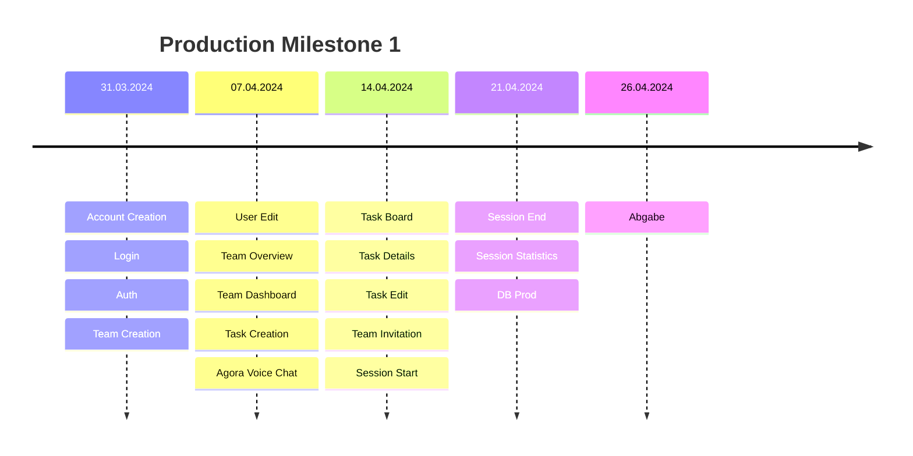

# Contributions

## Dynamically Planned Timeline

## 23.03.2024 - 29.03.2024

### 5v3nn

- https://github.com/sopra-fs24-group07/sopra-fs24-group-07-server/issues/29:
  DB setup
- https://github.com/sopra-fs24-group07/sopra-fs24-group-07-server/issues/82:
  Auth/login endpoint, service
- https://github.com/sopra-fs24-group07/sopra-fs24-group-07-server/issues/19:
  Account creation service
- https://github.com/sopra-fs24-group07/sopra-fs24-group-07-server/issues/16:
  Login service
- https://github.com/sopra-fs24-group07/sopra-fs24-group-07-server/issues/15:
  Login endpoint (also done in
  https://github.com/sopra-fs24-group07/sopra-fs24-group-07-server/issues/82)
- https://github.com/sopra-fs24-group07/sopra-fs24-group-07-server/issues/17:
  Login tests and docu
- https://github.com/sopra-fs24-group07/sopra-fs24-group-07-server/issues/25:
  Create team service
- https://github.com/sopra-fs24-group07/sopra-fs24-group-07-server/issues/26:
  Create team tests and docu
- https://github.com/sopra-fs24-group07/sopra-fs24-group-07-server/issues/24:
  Create team api endpoint

### B1s9l

- https://github.com/sopra-fs24-group07/sopra-fs24-group-07-client/issues/29:
  Landing page & Header setup
- https://github.com/sopra-fs24-group07/sopra-fs24-group-07-client/issues/4:
  Teams Overview page

### Monti934

- https://github.com/sopra-fs24-group07/sopra-fs24-group-07-server/issues/15:
  Login endpoint
- https://github.com/sopra-fs24-group07/sopra-fs24-group-07-server/issues/50:
  Read Agora Documentation

### Alihan26

- https://github.com/sopra-fs24-group07/sopra-fs24-group-07-server/issues/20:
  Account Creation API endpoint
- https://github.com/sopra-fs24-group07/sopra-fs24-group-07-server/issues/21:
  Account Creation tests and docu

## 30.03.2024 - 05.04.2024

### 5v3nn

- https://github.com/sopra-fs24-group07/sopra-fs24-group-07-server/issues/86:
  Link user to team
- https://github.com/sopra-fs24-group07/sopra-fs24-group-07-server/issues/91:
  Add creator to team on team create
- https://github.com/sopra-fs24-group07/sopra-fs24-group-07-server/issues/93:
  Get teams of user
- https://github.com/sopra-fs24-group07/sopra-fs24-group-07-server/issues/95:
  Get users of team
- https://github.com/sopra-fs24-group07/sopra-fs24-group-07-server/issues/53:
  User profile edit api endpoints

### B1s9l

- https://github.com/sopra-fs24-group07/sopra-fs24-group-07-client/issues/2:
  Account creation form done
- https://github.com/sopra-fs24-group07/sopra-fs24-group-07-client/issues/3:
  Login form done

### Monti934

- https://github.com/sopra-fs24-group07/sopra-fs24-group-07-client/issues/2:
  Account creation form done
- https://github.com/sopra-fs24-group07/sopra-fs24-group-07-client/issues/6:
  Dashboard UI done
- https://github.com/sopra-fs24-group07/sopra-fs24-group-07-client/issues/9:
  Create task UI form
- https://github.com/sopra-fs24-group07/sopra-fs24-group-07-client/issues/21:
  Start Session Container

### Alihan26

- https://github.com/sopra-fs24-group07/sopra-fs24-group-07-server/issues/53:
  User profile edit api endpoints
- https://github.com/sopra-fs24-group07/sopra-fs24-group-07-server/issues/54:
  User profile edit services
- https://github.com/sopra-fs24-group07/sopra-fs24-group-07-server/issues/55:
  User profile tests and docu

## 06.04.2024 - 12.04.2024

### B1s9l

- https://github.com/sopra-fs24-group07/sopra-fs24-group-07-client/issues/5:
  Create Team UI form done
- https://github.com/sopra-fs24-group07/sopra-fs24-group-07-client/issues/26:
  Profile View Done
- https://github.com/sopra-fs24-group07/sopra-fs24-group-07-client/issues/27:
  Profile Render Done

## 13.04.2024 - 19.04.2024

## 20.04.2024 - 26.04.2024
